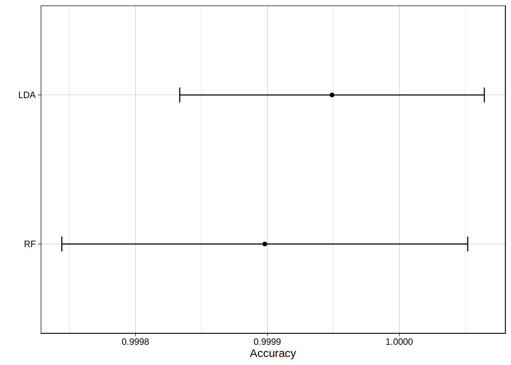

## CONTEXT  
Data from accelerometers on the belt, forearm, arm, and dumbell of 6 participants has been collected. They were asked to perform barbell lifts correctly and incorrectly in 5 different ways. This is the "classe" variable in the training set with five levels from A to E. The training set consists of 19622 observations for 160 variables (including "classe"). The goal of this homework is to build a model to predict the manner in which the exercise was done.  
More information here: http://groupware.les.inf.puc-rio.br/har
 


```r
set.seed(1234)
library(caret)
library(dplyr)
library(RANN)
```

```r
# Load data into a training and test set
if (!file.exists("pmlTraining.csv")){
    urlTrain <-"https://d396qusza40orc.cloudfront.net/predmachlearn/pml-training.csv"
    download.file(urlTrain, "pmlTraining.csv") }
if (!file.exists("pmlTesting.csv")){
    urlTest <-"https://d396qusza40orc.cloudfront.net/predmachlearn/pml-testing.csv"
    download.file(urlTest, "pmlTesting.csv") }
training = read.csv("pmlTraining.csv")
testing  = read.csv("pmlTesting.csv")
```


### PREPROCESSING  
We remove the variables that will not be used as predictors for building the models since they are descriptive statistics about the observations (e.g. ID, average, variance, minimum value, etc).

```r
dim(training)
```

```
## [1] 19622   160
```

```r
training <- training %>% select(!starts_with(c("avg", "var", "stddev", "min", "max")))
# Remove row id
training <- training %>% select(-"X")
dim(training)
```

```
## [1] 19622    95
```
Out of 160 variables, 95 are remaining. Then we remove the predictors which have zero or almost zero variance and will not be helpful for the construction of the model.

```r
var_res <- nearZeroVar(training,saveMetrics=TRUE)
training <- training %>% select_if(var_res$nzv==FALSE)
dim(training)
```

```
## [1] 19622    64
```
Out of 96 variables, 64 are remaining wich have non-zero variability. There are columns containing NA values so we could "fill" them in with K-nearest neighbours method. But some data inspection reveals that 6 variables account for all the NA values and that in those columns out of 19622 observations, 19216 are NA. So we remove those predictors as well 

```r
#  Get the sum of NA per columns/predictors
NA_filled <- training %>% 
             summarise(across( everything(),~sum(is.na(.)) )) %>%
             select(where(~.>0))
# Find out they are all aggregated in 6 columns
NA_filled
```

```
##   amplitude_roll_belt amplitude_pitch_belt amplitude_yaw_arm
## 1               19216                19216             19216
##   amplitude_roll_dumbbell amplitude_pitch_dumbbell amplitude_pitch_forearm
## 1                   19216                    19216                   19216
```

```r
# Remove those columns/predictors
training <- training %>% select(-c(colnames(NA_filled)))
# Get a quick look at the data
dim(training)
```

```
## [1] 19622    58
```

```r
training %>% select(classe) %>% table()
```

```
## .
##    A    B    C    D    E 
## 5580 3797 3422 3216 3607
```
We will consider 57 predictors.

### MODEL TRAINING  
We use 10 fold cross-validation to estimate the out of sample error. We perform two different kinds of analysis : a linear one (linear discriminant analysis) and a tree prediction (random forest). We will compare the accuracy of those models, choose the best performing one and proceed to the prediction. 

```r
train_control <- trainControl(method="cv", number=10)
modelLDA <- train(classe ~., data = training, method = "lda", trControl = train_control)
modelRF  <- train(classe ~., data = training, method = "rf", trControl = train_control, ntree = 10)
```

```r
# We can look at the accuracy from cross validation of the models
results <- resamples(list(LDA=modelLDA, RF=modelRF))
summary(results)
```

```
## 
## Call:
## summary.resamples(object = results)
## 
## Models: LDA, RF 
## Number of resamples: 10 
## 
## Accuracy 
##          Min.   1st Qu.    Median      Mean   3rd Qu.      Max. NA's
## LDA 0.8470948 0.8492104 0.8511354 0.8546027 0.8621877 0.8644931    0
## RF  0.9984702 0.9985987 0.9989812 0.9991335 0.9994903 1.0000000    0
## 
## Kappa 
##          Min.   1st Qu.    Median     Mean   3rd Qu.      Max. NA's
## LDA 0.8067475 0.8094463 0.8116944 0.816207 0.8257599 0.8286711    0
## RF  0.9980649 0.9982276 0.9987113 0.998904 0.9993553 1.0000000    0
```

```r
ggplot(results) + labs(y = "Accuracy") + theme_linedraw()
```

<!-- -->
  
  We can see that the random forest model perform better (Accuracy=0.9991335) than the linear discriminant analysis (Accuracy=0.8546027). It is possible that the data structure's assumptions (gaussian distribution in each class, same covariance) made in the context of the model-based linear analysis are not met while the random forest, free of those assumption on the data, yields a better accuracy. Also the LDA warned (warnings not shown) for colinearity of some predictors to which linear methods are specially weak. For all those reasons we will use the non-linear model for performing predictions on the testing set.


### MODEL TESTING  

```r
predRF  <- predict(modelRF,testing)
predRF
```

```
##  [1] B A B A A E D B A A B C B A E E A B B B
## Levels: A B C D E
```

### CONCLUSION  
The non-linear model using tree prediction (random forest) has, according to the ten fold cross-validation, an excellent out of sample accuracy of 99%. In this case it is probably not worth trying other models or model stacking.


